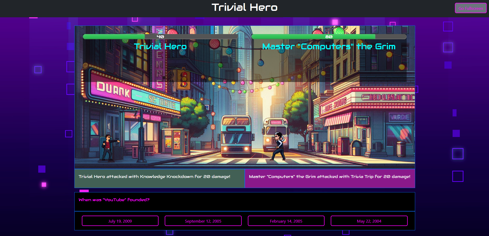
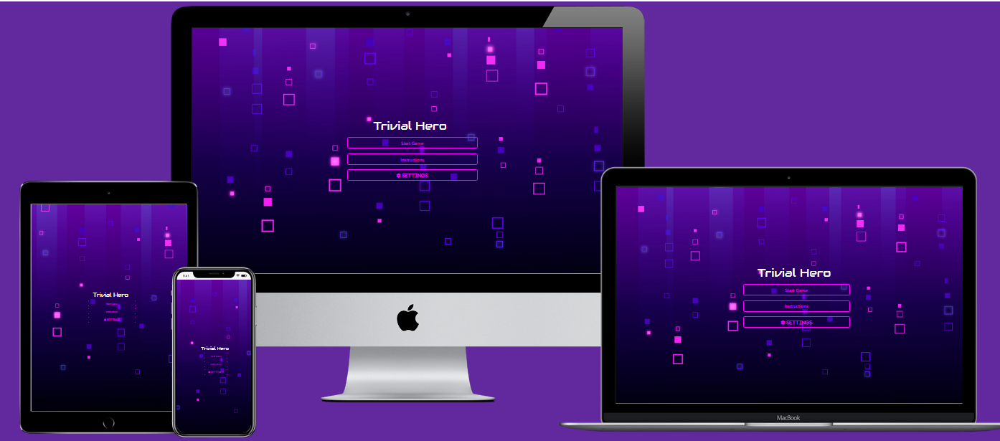
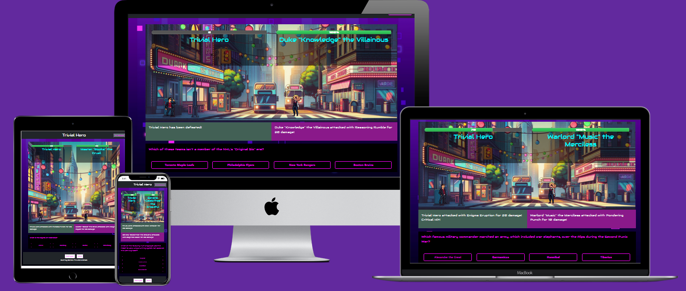

# Trivial Hero

**A hackathon project by Daniel Beckett, Philip Kershaw, and Michael Pymer**

You can find the live deployment of this project [here](https://philgck.github.io/Trivial-Hero/).

## Introduction

Trivial Hero is our first group hackathon project undertaken as part of the Code Institute Full Stack Development for the AI Augmented Developer. It aims to demonstrate our use of HTML, CSS, Bootstrap, and JavaScript, alongside agile development and use of AI tools where necessary to help with building and realizing tasks and ideas.

In Trivial Hero, you’ll guide a hero through a quizzical retro-arcade inspired showdown.

## Contents

- [Responsivity Examples](#responsivity-examples)
- [Wireframes](#wireframes)
- [User Stories](#user-stories)
- [Design / Features](#design--features)
- [Future Features](#future-features)
- [Technologies Used](#technologies-used)
- [Deployment](#deployment)
- [Bugs Encountered and Fixed](#bugs-encountered-and-fixed)
- [Testing](#testing)
- [Credits](#credits)

## Responsivity Examples

## Wireframes

Wireframes were created for the start game screen and the game area. In development, we also added settings, a header, and a footer for the game area.

- Mobile

- Tablet

- Desktop

## User Stories

### Must Have

#### Starting the Game

As a user, I want to start a trivia battle, so that I can face off against a villain in a fun and challenging way.

**Acceptance Criteria:**

- The game starts when I click the "Start Game" button.
- The game screen replaces the start menu screen.
- The hero and villain health bars are reset to 100%.
- A new set of trivia questions is fetched, and the first question is displayed.

#### Answering Questions

As a user, I want to select answers to trivia questions, so that I can attack the villain if I answer correctly or take damage if I’m wrong.

**Acceptance Criteria:**

- Each question displays four answer options, including one correct answer.
- Clicking an answer highlights it in green if correct or red if incorrect.
- The hero deals damage to the villain on a correct answer.
- The villain deals damage to the hero on an incorrect answer.

#### Managing Health Bars

As a user, I want to see the health of the hero and villain, so that I can track progress and know who is winning.

**Acceptance Criteria:**

- Hero and villain health bars visually decrease as they take damage.
- When a character’s health reaches 0, they are declared defeated.
- The game stops when either the hero or villain is defeated.

### Should Have

#### Resetting the Game

As a user, I want to restart the game at any time, so that I can play again with a clean slate.

**Acceptance Criteria:**

- Clicking the "Reset Game" button resets the health of both characters to 100%.
- The game fetches a new set of trivia questions.
- All answer buttons are cleared of their previous styles.

#### Visual Feedback

As a user, I want clear visual feedback when selecting answers, so that I know whether I answered correctly.

**Acceptance Criteria:**

- Correct answers are highlighted in green.
- Incorrect answers are highlighted in red, and the correct answer is highlighted in light green.
- Feedback remains visible for 2 seconds before moving to the next question.

#### Adjusting Gameplay Settings

As a user, I want to select the trivia category and difficulty before starting the game, so that I can customize the challenge to my preferences.

**Acceptance Criteria:**

- Dropdown menus allow me to choose a trivia category and difficulty level.
- The selected category and difficulty are used to fetch questions.

### Could Have

#### Dynamic Villain Naming

As a user, I want the villain’s name to match the trivia category, so that the game feels more immersive and thematic.

**Acceptance Criteria:**

- The villain’s name is dynamically generated using a prefix, the category name, and a suffix.
- The name updates when the trivia category changes during gameplay.

#### Adding Idle Sprite Animations

As a user, I want characters to have idle animations when not attacking, so that the game feels more polished and the characters appear lively.

**Acceptance Criteria:**

- The hero displays a subtle idle animation when not performing an action (e.g., breathing, shifting stance).
- The villain displays a subtle idle animation when not performing an action (e.g., menacing gestures, blinking).
- Idle animations are smooth and loop seamlessly.
- Animations do not interfere with attack animations or other gameplay mechanics.

#### Random Events

As a user, I want unexpected events to occur during gameplay, so that the game feels dynamic and exciting.

**Acceptance Criteria:**

- A random event may heal the hero or villain.
- A random event may cause the hero’s attack to miss.
- A random event may change the question category or difficulty.

#### Changing Hero Name

As a user, I want to customize my hero’s name, so that I can make the game feel more personalized.

**Acceptance Criteria:**

- I can type a name in the hero name input field.
- The hero’s name updates dynamically on the game screen.
- If no name is entered, the default name "Trivial Hero" is used.

#### Fullscreen Mode

As a user, I want to toggle fullscreen mode, so that I can enjoy a more immersive gameplay experience.

**Acceptance Criteria:**

- Clicking the "Go Fullscreen" button expands the game to fullscreen mode.
- Clicking the button again exits fullscreen mode.

## Design / Features

The design of Trivial Hero revolves around a retro arcade theme, combining dynamic visuals, interactivity, and randomization to create an engaging and nostalgic experience. Below is a breakdown of the design principles and implemented features:

### Core Design Principles

- **Accessibility:** Simple and intuitive controls allow players of all skill levels to engage easily.
- **Replayability:** Randomized elements ensure that each game feels fresh and unpredictable.
- **Aesthetic:** Pixel art, animations, and a vibrant color palette deliver a classic arcade feel.
- **Immersion:** Interactive fight mechanics, character animations, and a fight log keep players engaged in the action.

### Implemented Features

#### Trivia and Gameplay Mechanics

- **Trivia API Integration:** Uses the Open Trivia Database (OpenDB) API to provide trivia questions that influence gameplay. Players can select difficulty and category, adding a layer of customization to their experience.
- **Custom Hero Name:** Players can personalize their hero’s name, adding a unique touch to each session.

#### Character Design and Animations

- **Hero and Villain Sprites:** Designed in retro pixel art style to match the arcade theme. Each character has unique sprites for attack and idle animations.
- **Idle Animations:** Both hero and villain feature fluid idle animations, giving the game a lively and polished feel even during downtime.

#### Randomization for Replayability

- **Random Villain Names and Sprites:** Every match introduces a different villain, complete with unique names and appearances.
- **Random Events:** Mid-battle events introduce surprises, keeping the gameplay unpredictable and exciting.

#### Gameplay and Interface Features

- **Health Bars:** Visual indicators show the hero's and villain's remaining health, helping players track progress.
- **Fight Log:** A real-time combat log displays hero and villain actions, including trivia success outcomes and random quotes during attacks.
- **Arcade-Style UI:** Health bars, fight log, and buttons are styled to evoke a nostalgic arcade interface.

The design combines trivia challenges with arcade-style combat, ensuring that players are engaged through both mental puzzles and action-packed gameplay. Each design choice contributes to the core themes of fun, nostalgia, and unpredictability.

## Bugs Encountered and Fixed

#### Fullscreen Button

- **Bug:** The fullscreen button was not functioning correctly, failing to toggle the game into fullscreen mode.
- **Bug:** The game did not end when either the hero's or villain's health reached 0, causing the game to continue indefinitely.
- **Bug:** The footer was not aligned correctly on different screen sizes, causing layout issues.

## Future Features

While Trivial Hero offers an engaging retro arcade experience, there are several exciting features and improvements planned for future updates. These enhancements will further elevate the gameplay, visuals, and overall immersion, ensuring a continually fresh and dynamic experience.

### Planned Enhancements

- **Background Music and Sound Effects:** Introduce immersive background music and sound effects during battles to further enhance the retro arcade atmosphere. Different tracks may be featured for various stages of the game, creating a more dynamic experience. Sound effects for attacks, health bar reductions, and random events will be added to make combat feel more impactful.
- **Expanded Attack Animations:** Additional attack animations will be implemented for both the hero and villain, adding variety and excitement to the combat sequences. These new animations will bring more visual flair to every action, making each fight feel unique.
- **Random Hero and Villain Quotes:** Introduce random quotes from both the hero and villain during attacks. These quotes will add personality and humor to the characters, giving them more depth and making battles more engaging. The quotes will be generated dynamically based on the situation, adding an extra layer of surprise.
- **Random Villain Sprites per Game:** Further diversify the game experience by randomly selecting villain sprites for each new game. This will ensure that no two villains look alike, adding an element of surprise and keeping the game feeling fresh with every playthrough.

## Technologies Used

### Languages

- [HTML5](https://en.wikipedia.org/wiki/HTML5)
- [CSS3](https://en.wikipedia.org/wiki/Cascading_Style_Sheets)
- [JavaScript](https://en.wikipedia.org/wiki/JavaScript)

### Frameworks, Libraries, and Programs

- [Bootstrap 5.3.3](https://getbootstrap.com/docs/5.3/getting-started/introduction/)
- [Font Awesome](https://fontawesome.com/)
- [Visual Studio Code](https://code.visualstudio.com/)
- [GitHub](https://github.com/)
- [Text Studio](https://www.textstudio.com/)
- [Google Fonts](https://fonts.google.com/)
- [ChatGPT](https://openai.com/index/chatgpt/)
- [Copilot](https://copilot.microsoft.com/)

### External Resources

- [W3 Schools](https://www.w3schools.com/)
- [YouTube](https://www.youtube.com/)
- [Online Gift Tools](https://onlinegiftools.com/convert-sprite-sheet-to-gif)
- [Am I Responsive](https://amiresponsive.co.uk/)

## Deployment

You can find the live deployment of this project [here](https://philgck.github.io/Trivial-Hero/).

## Testing

- [HTML Validator](https://validator.w3.org/)
- [CSS Validator](https://jigsaw.w3.org/css-validator/)
- [WAVE Validator](https://wave.webaim.org/)
- [JS Validator](https://jshint.com/)
- [Lighthouse Testing](https://developer.chrome.com/docs/lighthouse/overview)

## Credits

### Media

- [Font Awesome](https://kit.fontawesome.com/956711f51a.js)
- [Freepik](https://www.freepik.com/free-vector/abstract-pixel-rain-background_6338223.htm#fromView=search&page=1&position=24&uuid=0dc2e7f3-6b39-4e27-94f1-bfd03046696a) for background
- [CraftPix](https://craftpix.net/freebies/city-man-pixel-art-character-sprite-sheets/?num=2&count=1004&sq=casual%20character%20modern%20pixel&pos=3) for hero sprites
- [CraftPix](https://craftpix.net/freebies/free-vampire-pixel-art-sprite-sheets/?num=1&count=20&sq=vampire&pos=4) for villain sprites

### Acknowledgements and Thanks

- Bootstrap – for some of the initial coding.
- Copilot and ChatGPT – for suggestions, clarifications, and bug fixes.
- YouTube sources – for some project walkthroughs watched for ideas at the start of the project.
- W3Schools – for some clarifications.
- Code Institute:
    - Dillon McCaffrey – hackathon process facilitator.
    - Mark Briscoe – advice on branch mergers.
